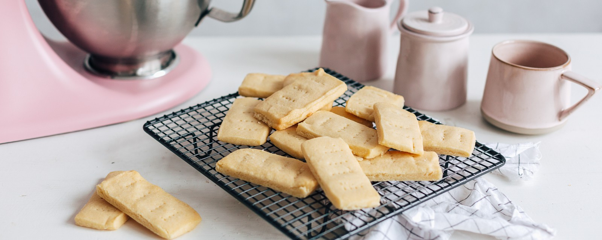

# Zandkoekjes met 3 ingrediënten

## Benodigdheden
    -240 g boter op kamertemperatuur
    -85 g glaceersuiker
    -270 g bloem

### Bereiding
    1.Doe de boter in de kom van de mixer/keukenrobot. Bevestig de platte menghaak en klop de boter op snelheid 6 gedurende 1 minuut romig.
    2.Voeg de glaceersuiker toe, schraap de kom en meng op snelheid 4 tot de suiker volledig is opgenomen. Voeg bloem toe en meng opnieuw op snelheid 2 tot er een deegbal is gevormd.
    3.Bekleed een bakvorm met bakpapier. Verdeel het deeg in de bakvorm en druk het aan.
    4.Laat 20 minuten rusten in de koelkast. Neem het bakpapier uit de bakvorm en plaats het op een bakplaat. Snijd het deeg in rechthoeken.
    5.Bak 12-15 minuten in een voorverwarmde oven van 160 °C. Laat de koekjes niet bruin worden. Haal de koekjes uit de oven en laat ze op een rooster helemaal afkoelen. 

    [Bron](https://www.kitchenaid.nl/recepten/zandkoekjes-met-3-ingredienten#ingredients) van het recept

